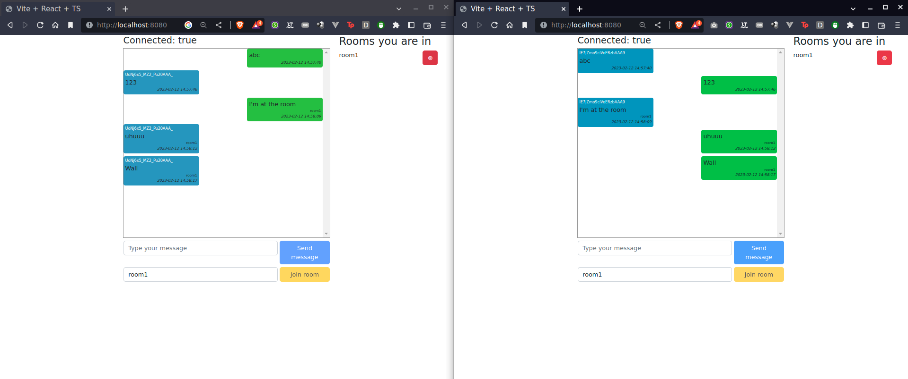

# socketio-chat
Creating a webchat with socket.io on the backend and react on the frontend

# Requirments 
1. docker
2. docker compose

# RUN
```sh
docker-compose up
```
> Open in two tabs at your browser at: http://localhost:8080
> 

# References
* https://www.youtube.com/watch?v=ZKEqqIO7n-k